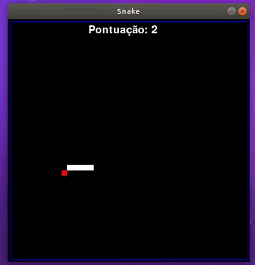

# Snake Game
Desenvolvimento do clássico Snake Game.


O jogo foi desenvolvido em linguagem Python, utilizando a biblioteca PyGame.

Todo desenvolvido no arquivo [snake.py](/snake.py)

## Descrição
O jogador controla uma longa e fina criatura que se arrasta pela tela, coletando comida (ou algum outro item), não podendo colidir com seu próprio corpo ou as "paredes" que cercam a área de jogo. Cada vez que a serpente come um pedaço de comida, seu rabo cresce, aumentando a dificuldade do jogo. O usuário controla a direção da cabeça da serpente (para cima, para baixo, esquerda e direita) e seu corpo segue ([Wikipedia](https://pt.wikipedia.org/wiki/Serpente_(jogo_eletr%C3%B4nico))).

## Execução
Abir prompt de comando na pasta onde está o arquivo snake.py

Executar o comando 
```
python snake.py
```

## Comandos
- w ou seta para cima :     UP
- s ou seta para baixo:     DOWN
- d ou seta para direita:   RIGHT
- a ou seta para esquerda:  LEFT

## Jogo
<center>

</center>
# Game over
<center>

</center>
